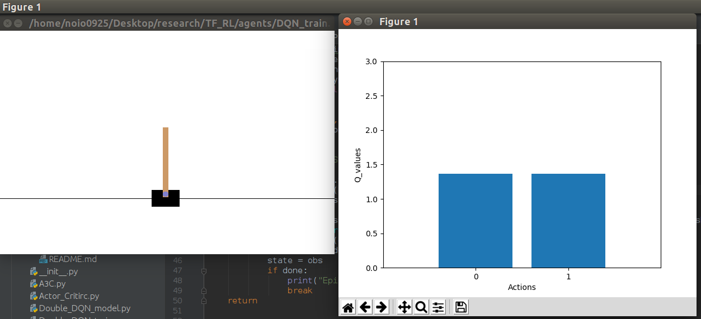
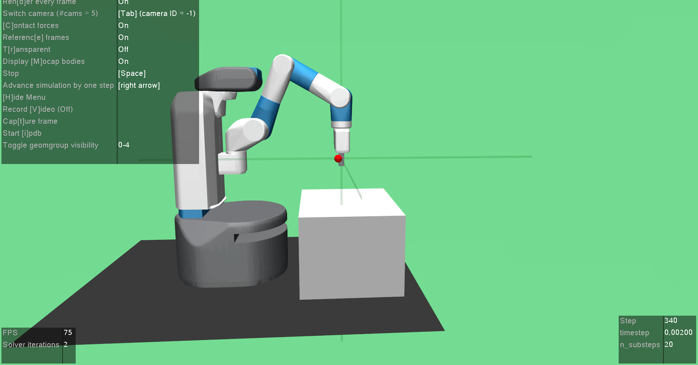

## TF-RL(Reinforcement Learning with Tensorflow: EAGER!!)

  This is the repo for implementing and experimenting the variety of RL algorithms using **Tensorflow Eager Execution**.


## Installation

- Install from Pypi(Test)

```shell
# this one
$ pip install --index-url https://test.pypi.org/simple/ --no-deps TF_RL
# or this one
$ pip install -i https://test.pypi.org/simple/ TF-RL
```

- Install from Github source

```shell
git clone https://github.com/Rowing0914/TF_RL.git
cd TF_RL
python setup.py install
```


## Features

1. Real time visualisation of an agent after training



2. Comparison: Performance of algorithms using Tensorboard


```shell
$ cd examples
# as of 26th in April, this is still in development
# so that it's not working! or check the path inside the scripts!
$ python3.6 comparisons.py
$ tensorboard --logdir=./logs/
```

3. Unit Test of a specific algorithm

```shell
$ cd examples
# Eager Execution mode
$ python3.6 {model_name}/{model_name}_eager.py
# Graph mode Tensorflow: most of them are still under development...
$ python3.6 unstable/{model_name}_train.py
```


## Implementations (To be re-ordered soon)

1. Playing Atari with Deep Reinforcement Learning, Mnih et al., 2013 [[arxiv]](https://www.cs.toronto.edu/~vmnih/docs/dqn.pdf) [[code]](<https://github.com/Rowing0914/TF_RL/blob/master/examples/DQN_eager.py>)
2. Deep Reinforcement Learning with Double Q-learning, van Hasselt et al., 2015 [[arxiv]](https://arxiv.org/abs/1509.06461) [[code]](<https://github.com/Rowing0914/TF_RL/blob/master/examples/Double_DQN_eager.py>)
3. Duelling Network Architectures for Deep Reinforcement Learning, Wang et al., 2016 [[arxiv]](https://arxiv.org/abs/1511.06581) [[code]](<https://github.com/Rowing0914/TF_RL/blob/master/examples/Duelling_Double_DQN_PER_eager.py>)
4. Prioritised Experience Replay, T.Shaul et al., 2015 [[arxiv]](https://arxiv.org/abs/1511.05952) [[code]](<https://github.com/Rowing0914/TF_RL/blob/master/examples/DQN_PER_eager.py>)
5. Asynchronous Methods for Deep Reinforcement Learning, Mnih et al., 2016 [[arxiv]](<https://arxiv.org/pdf/1602.01783.pdf>) [[code]](<https://github.com/Rowing0914/TF_RL/blob/master/agents/A3C.py>)
6. Deep Q-learning from Demonstrations, T.Hester et al., 2017 [[arxiv]](<https://arxiv.org/pdf/1704.03732.pdf>) [[code]](<https://github.com/Rowing0914/TF_RL/blob/master/examples/DQfD_eager.py>)
7. Actor-Critic Algorithms, VR Konda and JN Tsitsiklis., 2000 NIPS [[arxiv]](<https://papers.nips.cc/paper/1786-actor-critic-algorithms.pdf>) [[code]](<https://github.com/Rowing0914/TF_RL/blob/master/examples/Actor_Critic_eager.py>)
8. Policy Gradient Methods for Reinforcement Learning with Function Approximation., RS Sutton et al., 2000 NIPS [[arxiv]](<https://papers.nips.cc/paper/1713-policy-gradient-methods-for-reinforcement-learning-with-function-approximation.pdf>) [[code]](<https://github.com/Rowing0914/TF_RL/blob/master/examples/REINFORCE_eager.py>)

9. Continuous Control with Deep Reinforcement Leaning, TP Lillicrap et al., 2015 [[arxiv]](<https://arxiv.org/pdf/1509.02971.pdf>) [[code]](<https://github.com/Rowing0914/TF_RL/blob/master/examples/DDPG_eager.py>)


#### Future dev

1. Noisy Networks for Exploration, M.Fortunato et al., 2017 [[arxiv]](https://arxiv.org/abs/1706.10295) [[code]]()
2. Hindsight Experience Replay, M.Andrychowicz et al., 2017 [[arxiv]](<https://arxiv.org/pdf/1707.01495.pdf>)




### Textbook implementations: R.Sutton's Great Book!

- Ch2: Simple Bandit: [[code]](<https://github.com/Rowing0914/TF_RL/blob/master/agents/Sutton_RL_Intro/ch2_Bandit/simple_bandit_algo.py>)
- Ch3: MDP sample using OpenAI Gym: [[code]](<https://github.com/Rowing0914/TF_RL/blob/master/agents/Sutton_RL_Intro/ch3_MDP/pole_balancing.py>)
- Ch4: Dynamic Programming
  - [policy_evaluation.py](https://github.com/Rowing0914/TF_RL/blob/master/agents/Sutton_RL_Intro/ch4_DP/policy_evaluation.py)
  - [policy_iteration.py](https://github.com/Rowing0914/TF_RL/blob/master/agents/Sutton_RL_Intro/ch4_DP/policy_iteration.py)
  - [value_iteration.py](https://github.com/Rowing0914/TF_RL/blob/master/agents/Sutton_RL_Intro/ch4_DP/value_iteration.py)
- Ch5: Monte Carlo Methods
  - [first_visi_MC_control_without_ES.py](https://github.com/Rowing0914/TF_RL/blob/master/agents/Sutton_RL_Intro/ch5_MC/first_visi_MC_control_without_ES.py)
  - [first_visit_MC.py](https://github.com/Rowing0914/TF_RL/blob/master/agents/Sutton_RL_Intro/ch5_MC/first_visit_MC.py)
  - [first_visit_MC_ES.py](https://github.com/Rowing0914/TF_RL/blob/master/agents/Sutton_RL_Intro/ch5_MC/first_visit_MC_ES.py)
  - [off_policy_MC.py](https://github.com/Rowing0914/TF_RL/blob/master/agents/Sutton_RL_Intro/ch5_MC/off_policy_MC.py)
- Ch6: Temporal Difference Learning
  - [double_q_learning.py](https://github.com/Rowing0914/TF_RL/blob/master/agents/Sutton_RL_Intro/ch6_TD/double_q_learning.py)
  - [expected_sarsa.py](https://github.com/Rowing0914/TF_RL/blob/master/agents/Sutton_RL_Intro/ch6_TD/expected_sarsa.py)
  - [one_step_TD.py](https://github.com/Rowing0914/TF_RL/blob/master/agents/Sutton_RL_Intro/ch6_TD/one_step_TD.py)
  - [q_learning.py](https://github.com/Rowing0914/TF_RL/blob/master/agents/Sutton_RL_Intro/ch6_TD/q_learning.py)
  - [sarsa.py](https://github.com/Rowing0914/TF_RL/blob/master/agents/Sutton_RL_Intro/ch6_TD/sarsa.py)
- Ch7: n_step_Bootstraping
  - [n_step_TD.py](https://github.com/Rowing0914/TF_RL/blob/master/agents/Sutton_RL_Intro/ch7_n_step_Bootstraping/n_step_TD.py)
  - [n_step_offpolicy_sarsa.py](https://github.com/Rowing0914/TF_RL/blob/master/agents/Sutton_RL_Intro/ch7_n_step_Bootstraping/n_step_offpolicy_sarsa.py)
  - [n_step_sarsa.py](https://github.com/Rowing0914/TF_RL/blob/master/agents/Sutton_RL_Intro/ch7_n_step_Bootstraping/n_step_sarsa.py)
- Ch13: Policy Gradient
  - [Actor_Critic_CliffWalk.py](https://github.com/Rowing0914/TF_RL/blob/master/agents/Sutton_RL_Intro/ch13_Policy_Gradient/Actor_Critic_CliffWalk.py)
  - [Actor_Critic_MountainCar.py](https://github.com/Rowing0914/TF_RL/blob/master/agents/Sutton_RL_Intro/ch13_Policy_Gradient/Actor_Critic_MountainCar.py)
  - [REINFORCE.py](https://github.com/Rowing0914/TF_RL/blob/master/agents/Sutton_RL_Intro/ch13_Policy_Gradient/REINFORCE.py)
  - [REINFORCE_keras.py](https://github.com/Rowing0914/TF_RL/blob/master/agents/Sutton_RL_Intro/ch13_Policy_Gradient/REINFORCE_keras.py)


## Envs

- OS: Linux Ubuntu LTS 16.04
- Python: 3.6
- GPU: Gefoce GTX1060
- Tensorflow: 1.13.0
- CUDA: 10.0
- libcudnn: 7.4.1


### GPU Env Maintenance on Ubuntu 16.04 (CUDA 10)

  Check this link as well: <https://www.tensorflow.org/install/gpu>

```shell
# Add NVIDIA package repositories
# Add HTTPS support for apt-key
sudo apt-get install gnupg-curl
wget https://developer.download.nvidia.com/compute/cuda/repos/ubuntu1604/x86_64/cuda-repo-ubuntu1604_10.0.130-1_amd64.deb
sudo dpkg -i cuda-repo-ubuntu1604_10.0.130-1_amd64.deb
sudo apt-key adv --fetch-keys https://developer.download.nvidia.com/compute/cuda/repos/ubuntu1604/x86_64/7fa2af80.pub
sudo apt-get update
wget http://developer.download.nvidia.com/compute/machine-learning/repos/ubuntu1604/x86_64/nvidia-machine-learning-repo-ubuntu1604_1.0.0-1_amd64.deb
sudo apt install ./nvidia-machine-learning-repo-ubuntu1604_1.0.0-1_amd64.deb
sudo apt-get update

# Install NVIDIA Driver
# Issue with driver install requires creating /usr/lib/nvidia
sudo mkdir /usr/lib/nvidia
sudo apt-get install --no-install-recommends nvidia-410
# Reboot. Check that GPUs are visible using the command: nvidia-smi

# Install development and runtime libraries (~4GB)
sudo apt-get install --no-install-recommends \
    cuda-10-0 \
    libcudnn7=7.4.1.5-1+cuda10.0  \
    libcudnn7-dev=7.4.1.5-1+cuda10.0


# Install TensorRT. Requires that libcudnn7 is installed above.
sudo apt-get update && \
        sudo apt-get install nvinfer-runtime-trt-repo-ubuntu1604-5.0.2-ga-cuda10.0 \
        && sudo apt-get update \
        && sudo apt-get install -y --no-install-recommends libnvinfer-dev=5.0.2-1+cuda10.0
```


## Disclaimer: you will see similar codes in different source codes.

  In this repo, I would like to ignore the efficiency in development, because although I have seen a lot of clean and neat implementations of DRL algorithms on the net, I think sometimes they excessively modularise some components by introducing a lot of extra parameters or flags which are not in the original papers, in other words, they are toooo professional for me to play with. 

  So, in this repo I do not hesitate to re-use the same codes here or there. **BUT** I believe this way of organising the algorithms enhances our understanding more compared to try making the algorithms compact.


## References

- [@dennybritz's great repo](<https://github.com/dennybritz/reinforcement-learning>)
- [my research repo](<https://github.com/Rowing0914/Reinforcement_Learning>)
- [OpenAI Baselines](<https://github.com/openai/baselines>)
- [Keras-rl](<https://github.com/keras-rl/keras-rl>)