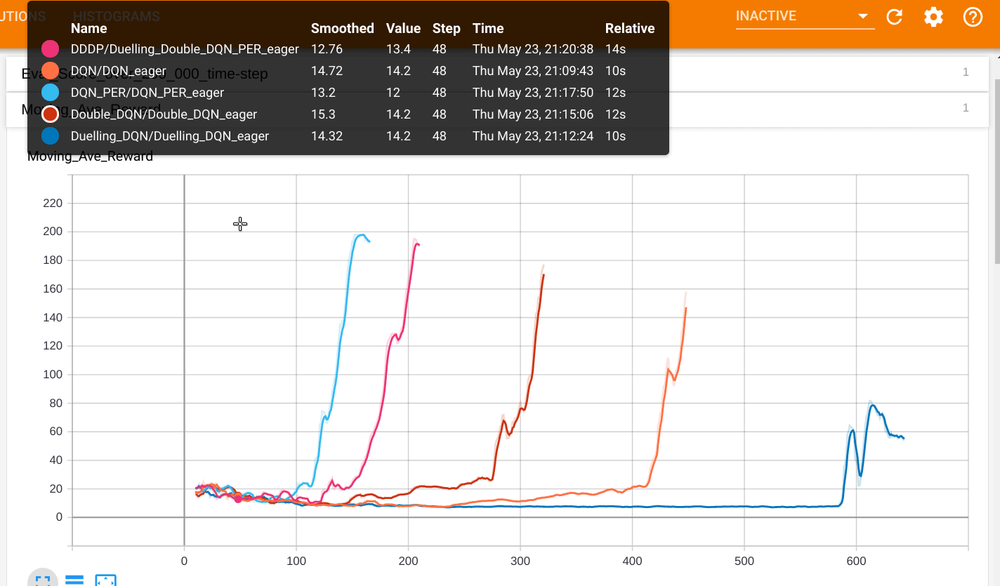

## TF-RL(Reinforcement Learning with Tensorflow: EAGER!!)

<p align="center"></p>

  This is the repo for implementing and experimenting the variety of RL algorithms using **Tensorflow Eager Execution**. And, since our Lord Google gracefully allows us to use their precious GPU resources without almost restriction, I have decided to enable most of codes run on **Google Colab**. So, if you don't have GPUs, please feel free to try it out on **Google Colab**

Note: As it is known that **Eager mode** takes time than **Graph Execution** in general so that in this repo, I use **Eager** for debugging and **Graph** mode for training!!! The beauty of eager mode come here!! we can flexibly switch eager mode and graph mode with minimal modification(`@tf.contrib.eager.defun`), pls check [**the link**](<https://medium.com/tensorflow/code-with-eager-execution-run-with-graphs-optimizing-your-code-with-revnet-as-an-example-6162333f9b08>)

## Installation

- Install from Pypi(Test)

```shell
# this one
$ pip install --index-url https://test.pypi.org/simple/ --no-deps TF_RL
# or this one
$ pip install -i https://test.pypi.org/simple/ TF-RL
```

- Install from Github source

```shell
git clone https://github.com/Rowing0914/TF_RL.git
cd TF_RL
python setup.py install
```


## Features

1. Real time visualisation of an agent after training


2. Comparison: Performance of algorithms *Duelling DQN is not working well on CartPole..



```shell
$ cd examples
$ python3.6 comparisons.py
$ cd ../
# run Tensorboard
$ sh run_tensorboad.sh
```

3. Unit Test of a specific algorithm

```shell
$ cd examples
# Graph Execution mode
$ python3.6 examples/{model_name}/{model_name}_eager.py
$ python3.6 examples/{model_name}/{model_name}_eager_cartpole.py

# Eager Execution mode
$ python3.6 examples/{model_name}/{model_name}_eager.py --debug_flg=True
$ python3.6 examples/{model_name}/{model_name}_eager_cartpole.py --debug_flg=True
```

4. Ready-to-run on Google colab( [Result of DQN](https://github.com/Rowing0914/TF_RL/blob/master/result/DQN/README.md) )

```shell
# you can run on google colab, but make sure that there some restriction on session
# 1. 90 minutes session reflesh
# 2. 12 Hours session reflesh
# Assuming you execute cmds below on Google Colab Jupyter Notebook
$ !git clone https://github.com/Rowing0914/TF_RL.git
$ pip install --index-url https://test.pypi.org/simple/ --no-deps TF_RL
$ %cd TF_RL
$ python3.6 examples/{model_name}/{model_name}_eager_atari.py --mode Atari --env_name={env_name} --google_colab=True

# === Execute On Your Local ===
# My dirty workaroud to avoid breaking the connection to Colab is to execute below on local PC
$ watch -n 3600 python3.6 {your_filename}.py

""" Save this code to {your_filename}.py
import pyautogui
import time

# terminal -> chrome or whatever
pyautogui.hotkey("alt", "tab")
time.sleep(0.5)
# reflesh a page
pyautogui.hotkey("ctrl", "r")
time.sleep(1)
# say "YES" to a confirmation dialogue
pyautogui.hotkey("Enter")
time.sleep(1)
# next page
pyautogui.hotkey("ctrl", "tab")
# check all page reload properly
pyautogui.hotkey("ctrl", "tab")
time.sleep(1)
# switch back to terminal
pyautogui.hotkey("alt", "tab")
time.sleep(0.5)
"""
```


## Implementations

1. Playing Atari with Deep Reinforcement Learning, Mnih et al., 2013 [[arxiv]](https://www.cs.toronto.edu/~vmnih/docs/dqn.pdf) [[code]](https://github.com/Rowing0914/TF_RL/tree/master/examples/DQN)
2. Deep Reinforcement Learning with Double Q-learning, van Hasselt et al., 2015 [[arxiv]](https://arxiv.org/abs/1509.06461) [[code]](https://github.com/Rowing0914/TF_RL/tree/master/examples/Double_DQN)
3. Duelling Network Architectures for Deep Reinforcement Learning, Wang et al., 2016 [[arxiv]](https://arxiv.org/abs/1511.06581) [[code]](https://github.com/Rowing0914/TF_RL/tree/master/examples/Duelling_DQN)
4. Prioritised Experience Replay, T.Shaul et al., 2015 [[arxiv]](https://arxiv.org/abs/1511.05952) [[code]](https://github.com/Rowing0914/TF_RL/tree/master/examples/DQN_PER)
5. Asynchronous Methods for Deep Reinforcement Learning, Mnih et al., 2016 [[arxiv]](<https://arxiv.org/pdf/1602.01783.pdf>) [[code]](<https://github.com/Rowing0914/TF_RL/blob/master/agents/A3C.py>)
6. Deep Q-learning from Demonstrations, T.Hester et al., 2017 [[arxiv]](<https://arxiv.org/pdf/1704.03732.pdf>) [[code]](https://github.com/Rowing0914/TF_RL/tree/master/examples/DQfD)
7. Actor-Critic Algorithms, VR Konda and JN Tsitsiklis., 2000 NIPS [[arxiv]](<https://papers.nips.cc/paper/1786-actor-critic-algorithms.pdf>) [[code]](https://github.com/Rowing0914/TF_RL/tree/master/examples/AC)
8. Policy Gradient Methods for Reinforcement Learning with Function Approximation, RS Sutton et al., 2000 NIPS [[arxiv]](<https://papers.nips.cc/paper/1713-policy-gradient-methods-for-reinforcement-learning-with-function-approximation.pdf>) [[code]](https://github.com/Rowing0914/TF_RL/blob/master/examples/REINFORCE)
9. Continuous Control with Deep Reinforcement Leaning, TP Lillicrap et al., 2015 [[arxiv]](<https://arxiv.org/pdf/1509.02971.pdf>) [[code]](https://github.com/Rowing0914/TF_RL/blob/master/examples/DDPG/)
10. Deep Recurrent Q-Learning for Partially Observable MDPs, M Hausknecht., 2015 [[arxiv]](<https://arxiv.org/abs/1507.06527>) [[code]](https://github.com/Rowing0914/TF_RL/blob/master/examples/DRQN/)
11. Hindsight Experience Replay, M.Andrychowicz et al., 2017 [[arxiv]](<https://arxiv.org/pdf/1707.01495.pdf>) [[code]](https://github.com/Rowing0914/TF_RL/blob/master/examples/HER/) [[video1]](https://youtu.be/zVV_lF_X4DA) [[video2]](https://youtu.be/OoG0A3hrMD4)
12. Soft Actor-Critic: Off-Policy Maximum Entropy Deep Reinforcement Learning with a Stochastic Actor, Haarnoja et al., 2018 [[arxiv]](<https://arxiv.org/abs/1801.01290>) [[code]](https://github.com/Rowing0914/TF_RL/tree/master/examples/SAC)
13. Trust Region Policy Optimization, J.Schulman et al., 2015 [[arxiv]](https://arxiv.org/abs/1502.05477) [[code]](https://github.com/Rowing0914/TF_RL/tree/master/examples/TRPO)


#### Results
- DQN: https://github.com/Rowing0914/TF_RL/tree/master/result/DQN
- DDPG: https://github.com/Rowing0914/TF_RL/tree/master/result/DDPG
- HER
    - [](http://www.youtube.com/watch?v=OoG0A3hrMD4 "HER Demo")

#### Future dev


1. Noisy Networks for Exploration, M.Fortunato et al., 2017 [[arxiv]](https://arxiv.org/abs/1706.10295)
3. Distributed DQN
3. C51
4. Rainbow etc...


### Textbook implementations: R.Sutton's Great Book!

https://github.com/Rowing0914/TF_RL/tree/master/examples/Sutton_RL_Intro


## Game Envs

### Atari Envs

```python
from tf_rl.common.wrappers import wrap_deepmind, make_atari
from tf_rl.common.params import ENV_LIST_NATURE, ENV_LIST_NIPS


# for env_name in ENV_LIST_NIPS:
for env_name in ENV_LIST_NATURE:
    env = wrap_deepmind(make_atari(env_name))
    state = env.reset()
    for t in range(10):
        # env.render()
        action = env.action_space.sample()
        next_state, reward, done, info = env.step(action)
        # print(reward, next_state)
        state = next_state
        if done:
            break
    print("{}: Episode finished after {} timesteps".format(env_name, t + 1))
    env.close()
```

### Atari Env with Revertable Wrapper
[[Youtube Demo]](https://www.youtube.com/watch?v=dAo2jn7ElLk&feature=youtu.be)

```python
import time, gym
from tf_rl.common.wrappers import wrap_deepmind, make_atari, ReplayResetEnv

env = wrap_deepmind(make_atari("PongNoFrameskip-v4"))
env = gym.wrappers.Monitor(env, "./video")
env = ReplayResetEnv(env)

state = env.reset()

for t in range(1, 1000):
    env.render()
    action = env.action_space.sample()
    next_state, reward, done, info = env.step(action)
    state = next_state

    if t == 300:
        time.sleep(0.5)
        recover_state = env.get_checkpoint_state()

    if (t > 300) and (t % 100 == 0):
        env.recover(recover_state)
        env.step(0)  # 1 extra step to burn the current state on ALE's RAM is required!!
        env.render()
        time.sleep(0.5)

env.close()
```

### CartPole-Pixel(Obs: Raw Pixels in NumpyArray)

```python
import gym
from tf_rl.common.wrappers import CartPole_Pixel

env = CartPole_Pixel(gym.make('CartPole-v0'))
for ep in range(2):
	env.reset()
	for t in range(100):
		o, r, done, _ = env.step(env.action_space.sample())
		print(o.shape)
		if done:
			break
env.close()
```

### MuJoCo(pls, check the MuJoCo official repo for more details...)

```python
# run this from the terminal and make sure you are loading appropriate environment variables
# $ echo $LD_LIBRARY_PATH

import gym
from tf_rl.common.params import DDPG_ENV_LIST

for env_name, goal_score in DDPG_ENV_LIST.items():
	env = gym.make(env_name)
	env.reset()
	for _ in range(100):
		env.render()
		env.step(env.action_space.sample()) # take a random action
```


## PC Envs

- OS: Linux Ubuntu LTS 16.04
- Python: 2.7/3.6 (For MuJoCo Env, 2.7 might not work)
- GPU: Gefoce GTX1060 Ti Max Q Design
- Tensorflow: 1.14.0(I have tested codes with 1.13.1 as well)
- CUDA: 10.0
- libcudnn: 7.4.1


### GPU Env Maintenance on Ubuntu 16.04 (CUDA 10)

  Check this link as well: <https://www.tensorflow.org/install/gpu>

```shell
# Add NVIDIA package repositories
# Add HTTPS support for apt-key
sudo apt-get install gnupg-curl
wget https://developer.download.nvidia.com/compute/cuda/repos/ubuntu1604/x86_64/cuda-repo-ubuntu1604_10.0.130-1_amd64.deb
sudo dpkg -i cuda-repo-ubuntu1604_10.0.130-1_amd64.deb
sudo apt-key adv --fetch-keys https://developer.download.nvidia.com/compute/cuda/repos/ubuntu1604/x86_64/7fa2af80.pub
sudo apt-get update
wget http://developer.download.nvidia.com/compute/machine-learning/repos/ubuntu1604/x86_64/nvidia-machine-learning-repo-ubuntu1604_1.0.0-1_amd64.deb
sudo apt install ./nvidia-machine-learning-repo-ubuntu1604_1.0.0-1_amd64.deb
sudo apt-get update

# Install NVIDIA Driver
# Issue with driver install requires creating /usr/lib/nvidia
sudo mkdir /usr/lib/nvidia
sudo apt-get install --no-install-recommends nvidia-410
# Reboot. Check that GPUs are visible using the command: nvidia-smi

# Install development and runtime libraries (~4GB)
sudo apt-get install --no-install-recommends \
    cuda-10-0 \
    libcudnn7=7.4.1.5-1+cuda10.0  \
    libcudnn7-dev=7.4.1.5-1+cuda10.0


# Install TensorRT. Requires that libcudnn7 is installed above.
sudo apt-get update && \
        sudo apt-get install nvinfer-runtime-trt-repo-ubuntu1604-5.0.2-ga-cuda10.0 \
        && sudo apt-get update \
        && sudo apt-get install -y --no-install-recommends libnvinfer-dev=5.0.2-1+cuda10.0
```


## Disclaimer: you will see similar codes in different source codes.

  In this repo, I would like to ignore the efficiency in development, because although I have seen a lot of clean and neat implementations of DRL algorithms on the net, I think sometimes they excessively modularise some components by introducing a lot of extra parameters or flags which are not in the original papers, in other words, they are toooo professional for me to play with. 

  So, in this repo I do not hesitate to re-use the same codes here or there. **BUT** I believe this way of organising the algorithms enhances experimentability a lot compared to try making the algorithms compact and professional.


## References

- [Logomaker](<https://www.logaster.co.uk/?_ga=2.128584591.2087808828.1559775482-1265517291.1559775482>)
- if you get stuck at DQN, you may want to refer to this great guy's entry: <https://adgefficiency.com/dqn-debugging/>
- [@dennybritz's great repo](<https://github.com/dennybritz/reinforcement-learning>)
- [my research repo](<https://github.com/Rowing0914/Reinforcement_Learning>)
- [OpenAI Baselines](<https://github.com/openai/baselines>)
- [Keras-rl](<https://github.com/keras-rl/keras-rl>)
