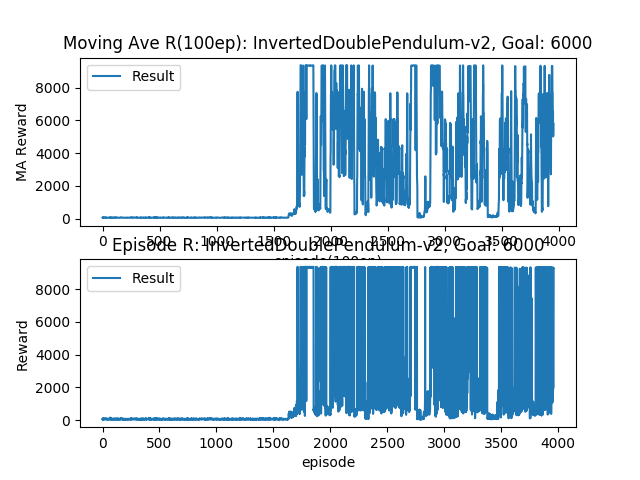

## Params

|      Item       |       Value        |
| :-------------: | :----------------: |
|     loss_fn     |        MSE         |
|  grad_clip_flg  |        None        |
|   num_frames    |   1,000,000(1M)    |
| train_interval  |        100         |
| nb_train_steps  |         50         |
| learning_start  | After 50,000 steps |
|   memory_size   |      100,000       |
|   batch_size    |        100         |
|      gamma      |        0.99        |
|     L2_reg      |        0.5         |
| soft_update_tau |        0.01        |
| optimiser(Actor)|    Adam(lr=1e-4)   |
| optimiser(Critic)|   Adam(lr=1e-3)   |

# Scores

### baselines result

<https://github.com/openai/baselines-results/blob/master/param-noise/mujoco.md>

### My result
#### Without Target Line

#### With Target Line(Targets are derived from baselines website)

