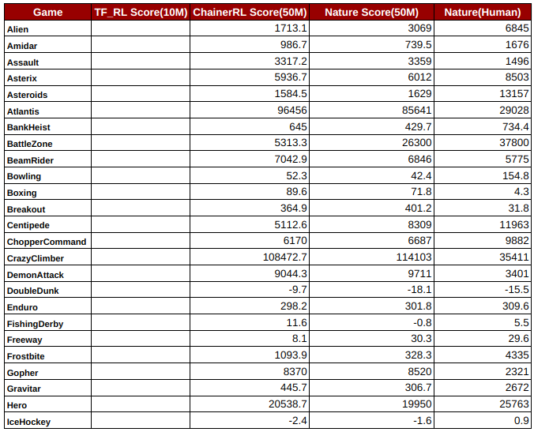
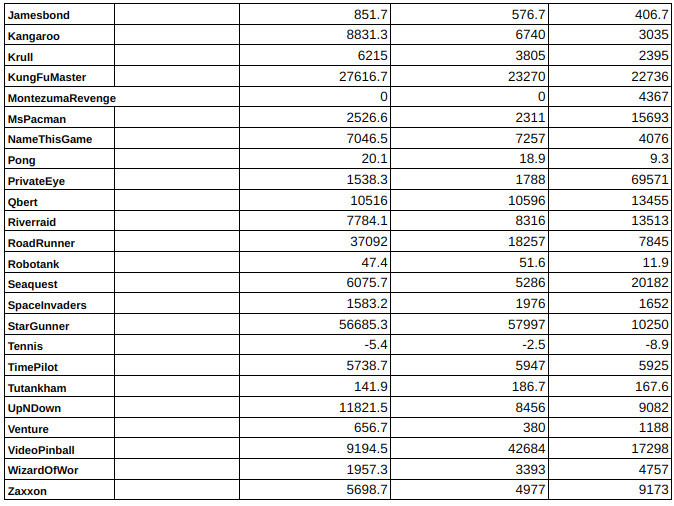

# Summary

- In this experiment, we have tried MSE/Huber_loss respectively and observed the difference
- In contrast to the Nature paper(trained for 50M), We trained for 10M.

## Video

- [Youtube video](https://youtu.be/71o94yfJY94)

## Plots

- Labels
  - 	Red: RMSProp with MSE(`tf_rl/examples/DQN/config/experimental/rmsprop_mse.gin`)
  - 	Dark blue: RMSProp with Huber(`tf_rl/examples/DQN/config/dopamine.gin`)
  - 	Orange: Adam with MSE(`tf_rl/examples/DQN/config/experimental/adam_mse.gin`)
  - 	Right blue: Adam with Huber(`tf_rl/examples/DQN/config/experimental/adam_huber.gin`)

 

 

## To reproduce

- Pls, follow the instruction on [here](https://github.com/Rowing0914/TF_RL/tree/tf2/tf_rl/examples/DQN)

# Benchmark Scores: to be filled soon

