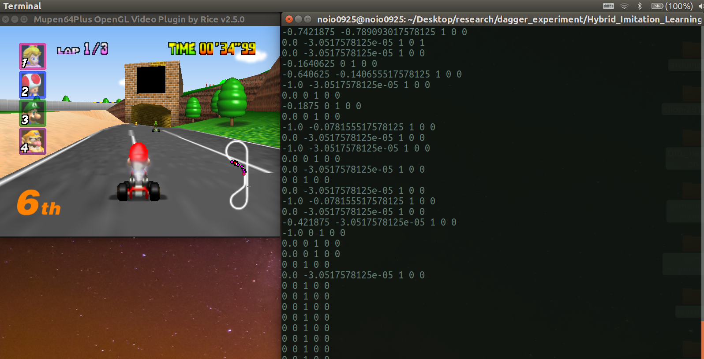

## Introduction

This is the repo for the experiments of DAgger, DQN and other state-of-the-art algorithms on the environment of [mupen64plus : Mario-Kart](https://mupen64plus.org/).


## My Env

- OS: Ubuntu 16.0.4 LTS
- GPU: GTX 1060 Max Q
- Python: 3.6.0
- Mupen64plus: v2.5


## Installation of mupen64plus

1. Download the latest version version of Mupen64Plus: [GITHUB MUPEN64PLUS](https://github.com/mupen64plus/mupen64plus-core/releases/download/2.5/mupen64plus-bundle-linux64-2.5-ubuntu.tar.gz)
2. `tar xvf mupen64plus-bundle-linux64-x.x-ubuntu.tar.gz`
3. `cd mupen64plus-bundle-linux64-x.x-ubuntu`
4. `sudo ./install.sh`
5. Or, maybe you can follow [this](https://www.google.com/search?ei=yTZXXMu2CNiY1fAPxPCk8Ag&q=sudo+apt-get+install+mupen64plus&oq=sudo+mupen64plus+apt-get&gs_l=psy-ab.3.0.0i8i30.1704.2033..4273...0.0..0.92.319.5......0....1..gws-wiz.......35i304i39j0i8i7i30j0i8i13i30.LHtrrL2hw0I)


## Usage

```bash
# Start your emulator program (`mupen64plus`) and run Mario Kart 64
# ============ Note ============
# 1. Make sure you have a joystick connected and that `mupen64plus` is using the sdl input plugin
# 2. Position the emulator window so that the image is captured by the program (top left corner)
$ sh play_mario_kart.sh

# Run `sh start.sh`, and check the terminal console's instruction(by default, we go through 2 episodes, but if you have enough time, then you can definitely increase this!)
$ sh start.run
```


1. Start your emulator program (`mupen64plus`) and run Mario Kart 64
2. Make sure you have a joystick connected and that `mupen64plus` is using the sdl input plugin
3. **Position the emulator window so that the image is captured by the program (top left corner)**
4. Run `sh start.sh`, and check the terminal console's instruction(by default, we go through **2** episodes, but if you have enough time, then you can definitely increase this!)


## Image




## To-Do

1. Implement the training modules for the learning algorithms
2. Implement some logging function of the learning, e.g., Tensorboard!