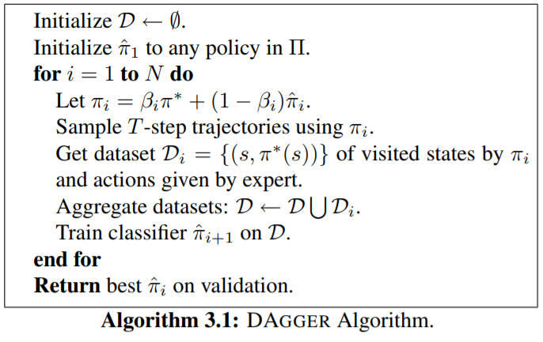
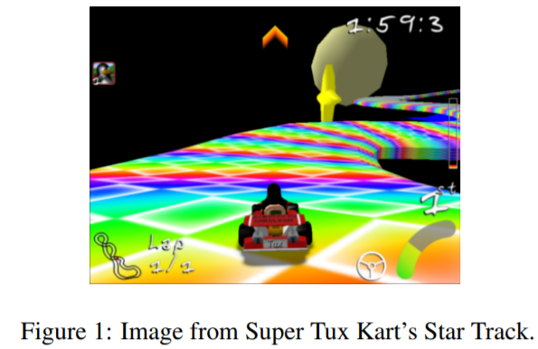
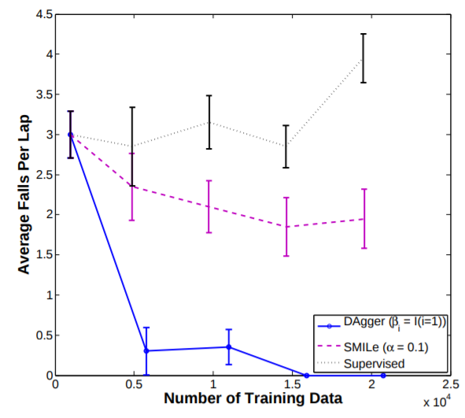
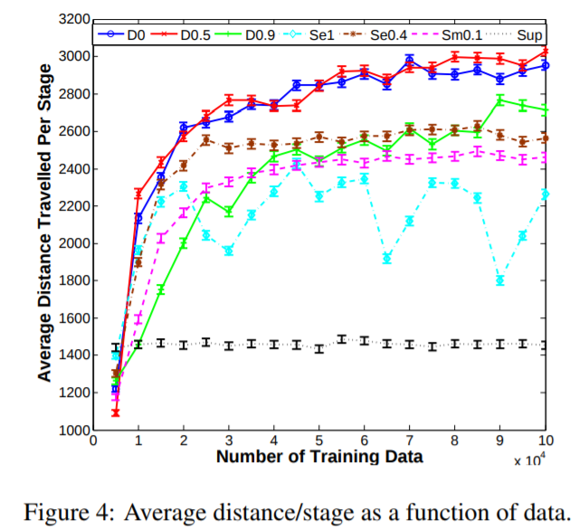

## Main paper

- Title: A Reduction of Imitation Learning and Structured Prediction to No-Regret Online Learning
- Authors: Stephane Ross, Geoffrey J. Gordon J.Andrew Bagnell
- Year: 2011

## Note

### Summary

- Sequential prediction problems such as imitation learning, where future observations depend on previous predictions (actions), violate the common **i.i.d. assumptions** made in statistical learning
- Some recent approaches(SMILe, SEARN) requires a large number of iterations and training
- DAgger can train a stationary deterministic policy, that can be seen as a no regret algorithm in an online learning setting

### Problem Statement

- since the learner’s prediction affects future input observations/states during execution of the learned policy, this violate the crucial i.i.d. assumption
- a classifier that makes a mistake with probability $\epsilon$ under the distribution of states/observations encountered by the expert can make as many as $T^2\epsilon$ mistakes in expectation over T-steps under the distribution of states the classifier itself induces
  - Intuitively this is because as soon as the learner makes a mistake, it may encounter completely different observations than those under expert demonstration, leading to a compounding of errors
- Although recent aproaches(SEARN, SMILe) can overcome this issue and guarantee an expected number of mistakes increase linearly over T-step, but they suffer from the inefficient training and simply not applicable to the read-world problems(infinite space problems) because it requires a lot of expensive training at each step during training.

### DAgger(Dataset Aggregation)

- In its simplest description, the algorithm proceeds as follows;	
  - DAGGER proceeds by collecting a dataset at each iteration under the current policy and trains the next policy under the aggregate of all collected datasets.
  - at the first iteration, it uses the expert's policy to gather a dataset of trajectories $D​$ and train a policy $\hat{\pi}_2​$ that best mimics the expert on $D​$ using a statistical learning approach, e.g., neural networks. Then at iteration $n​$, it uses $\hat{\pi}_n​$ to collect more trajectories and adds those trajectories to the dataset $D​$. The next policy $\hat{\pi}_{n+1}​$ is trained on the updated $D​$.

### Experiments

- Super Tux Kart

  - they examined DAgger on Super Tux Kart and confirmed that how fast the agent falls down from the course.

    

    

- Super Mario Bros.

  - they examined DAgger on Super Mario Bros and confirmed that how far the agent can go without dieing

    

    

