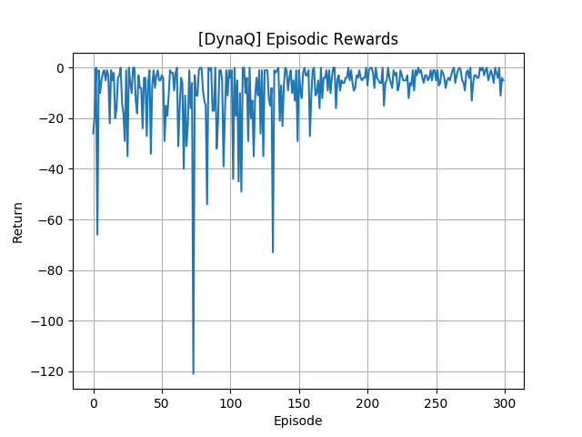
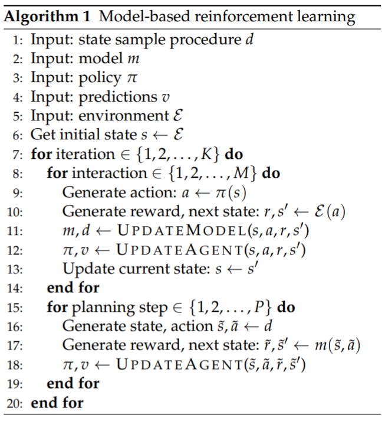

## Introduction

Dyna Q


## Usage
```shell script
python tf_rl/examples/DynaQ/main.py
```


## Result




## General Framework of Model-based RL
Source: [Hado van Hasselt et al., 2019](https://arxiv.org/pdf/1906.05243.pdf)




## Interesting Future Direction
- Does Dyna Q work well even on the continuous state space?
    - how about `Cartpole-v0` in OpenAI gym??
    - or other complicated envs?? e.g., POMDP tasks(Atari)??
- Is it really sample efficient??


## a bit of Surveying
- seems like well used in some Dialogue policy learning in NLP domain
    - [Deep Dyna Q](https://arxiv.org/abs/1801.06176) and other extensions
- Used in Planning as well
- some researches pay attention to 
    - how to avoid the overfitting at the early stage of training by incorporating the uncertainties
        - https://ieeexplore.ieee.org/abstract/document/8383982/
    - Usage of powerful Deep model-free agent in Dyna architecture
        - https://arxiv.org/abs/1806.01825
        - https://arxiv.org/pdf/1903.03234.pdf
- some techniques to improve the sample efficiency
    - ex) https://arxiv.org/pdf/1911.11285.pdf